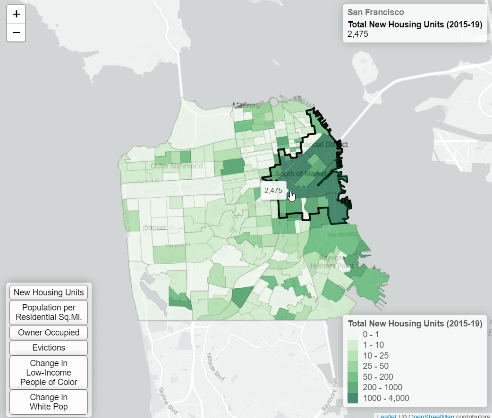

# SF Bay Area Permits Web Map
***MUSA 650 & CPLN 680 Final Project***

*by Alex Nelms*

## Project Proposal
My MUSA Capstone aims to understand the relationship between building construction permits and the San Francisco Bay Area's housing crisis between 2010 and 2022. For my MUSA 650 final project, an intereactive web map will visualize my larger capstone project's comparision of permits, 'gentrification' metrics, & housing affordability. [[github](https://github.com/CPLN-680-Spring-2022/Nelms_Alex_BuildingPermits), [website](https://nelmsal.github.io/PermitMetrics_FinalReport.html)]

In summary, this webmap displays:
 * a chloropleth map
 * Bay Area permits from 2015 to 2019
 * metrics displaying different housing & gentrification metrics:
     * New Housing Units (2015-19), [*from SF Open Data*](https://data.sfgov.org/Housing-and-Buildings/Building-Permits/i98e-djp9)
     * Population per Residential Sq.Mi. (2018), [*from SF Open Data*](https://data.sfgov.org/Geographic-Locations-and-Boundaries/Parcels-Active-and-Retired/acdm-wktn)
     * % Owner Occupied Units, [*from Urban Displacement Project (UDP)*](https://www.urbandisplacement.org/maps/sf-bay-area-gentrification-and-displacement/)
     * Evictions (2010-19), [*from SF Open Data*](https://data.sfgov.org/Housing-and-Buildings/Eviction-Notices/5cei-gny5)
     * Change in Low-Income People of Color (2010-15), [*from UDP*](https://github.com/urban-displacement/displacement-typologies)
     * Change in Percent White (2010-15), [*from UDP*](https://github.com/urban-displacement/displacement-typologies)
 * An outline of significantly high housing units being added. Found by using the Local Indicator of Spatial Autocorrelation

### Introduction
The San Francisco Bay Area is currently in the middle of a housing crisis – where housing prices, homelessness, and inequalities are at an all time high. Genenerally, the core issue is that housing supply has not grown at the rate of demand for the last 60 years. The low rate of constructed homes is the result of city councils & regulations favoring wealthy NIMBY residents and limiting the amount & quality of building permits. The lack of quality local government data has made it difficult to form direct causality between exclusionary regulations and limited building permits to the larger issues of unafforadble housing and 'gentrification'.

My MUSA capstone ([github](https://github.com/CPLN-680-Spring-2022/Nelms_Alex_BuildingPermits)) seeks to geolocate building permits in San Francisco & other Bay Area cities in order to relate it with changes in housing, demographic, and economic metrics. The analyzed data should be building permits aggregated at the Block Group, with the associate metrics. 
